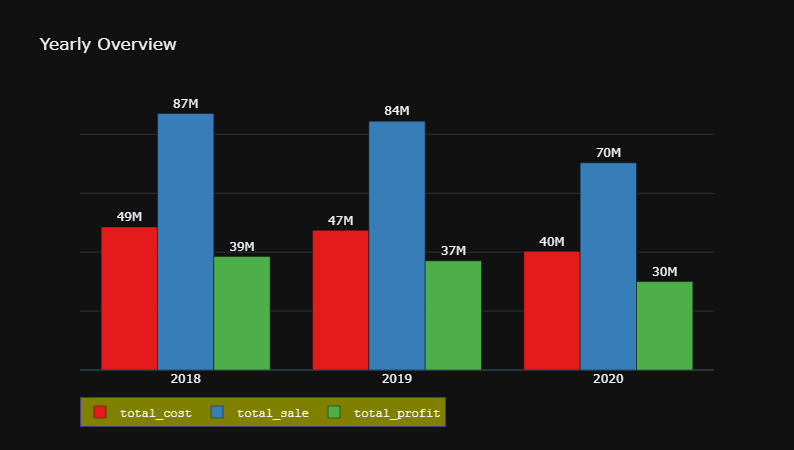
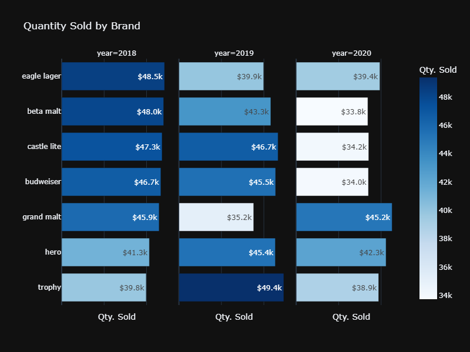
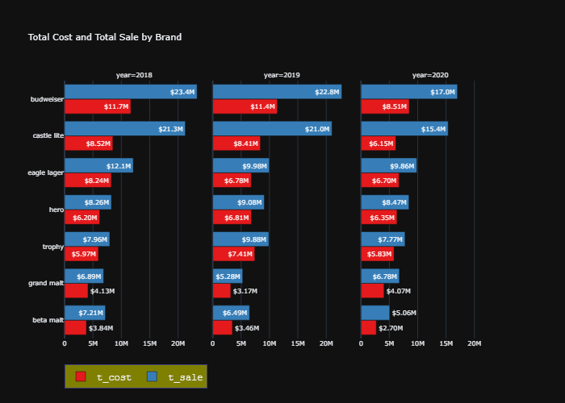
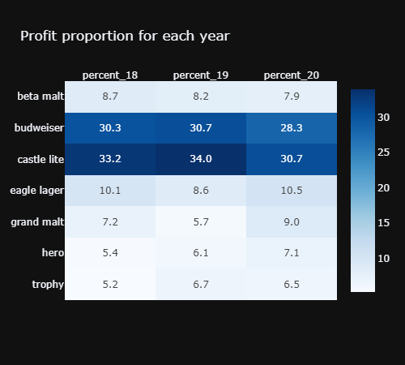
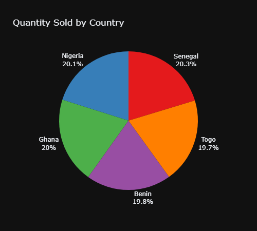
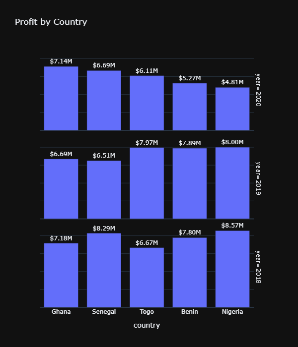
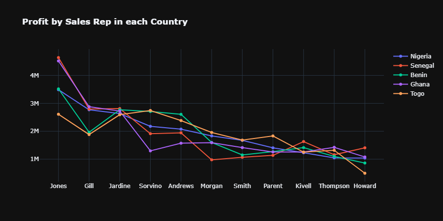
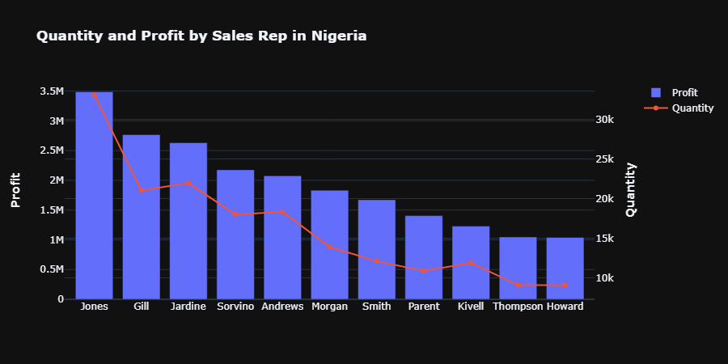

# International Breweries Analysis

### Watch the class Video
* [Part 1 Introductory Class](https://youtu.be/rsZd7PqbOhk)
* [Part 2 International Breweries EDA](https://youtu.be/2fQtBOlcP6w)
[View Introductory Notebook](https://github.com/TelRich/International-Breweries-Analysis-with-SQL-and-Python/blob/main/intro.ipynb)
[View Project Notebook](https://nbviewer.org/github/TelRich/International-Breweries-Analysis-with-SQL-and-Python/blob/main/brew.ipynb)

### Introduction
International Breweries Plc manufactures beer and non-alcoholic malt drinks. Its activities include the brewing, packaging, and marketing of beer, alcoholic flavoured and non-flavoured alcoholic beverages, and soft drinks. The company was founded by Lawrence Omole on December 22, 1971 and is headquartered in Lagos, Nigeria.

### Project Aim:
This project was created for learning purpose. 

* It was design for student, to help them understand how to connect to a database on a local host using the necessary connection strings.
* In the process, they get to familiarize themselves with some SQL queries by using it to query the database for insights.
* Lastly, it shows the student how to visualize the output with Python Plotly interactive library

### Data Description

|Columns|Type|
|---|---|
|Sales_ID|char(5)|	
|Region| varchar(25)|	
|Months| varchar(25)|	
|Year| smallint |	
|Sales_Rep| varchar(25)|	
|Brands| varchar(25)|	
|Unit_Cost| smallint|	
|Unit_Price|smallint|	
|Quantity|smallint|	
|Country| varchar(25)|

